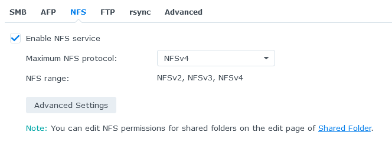
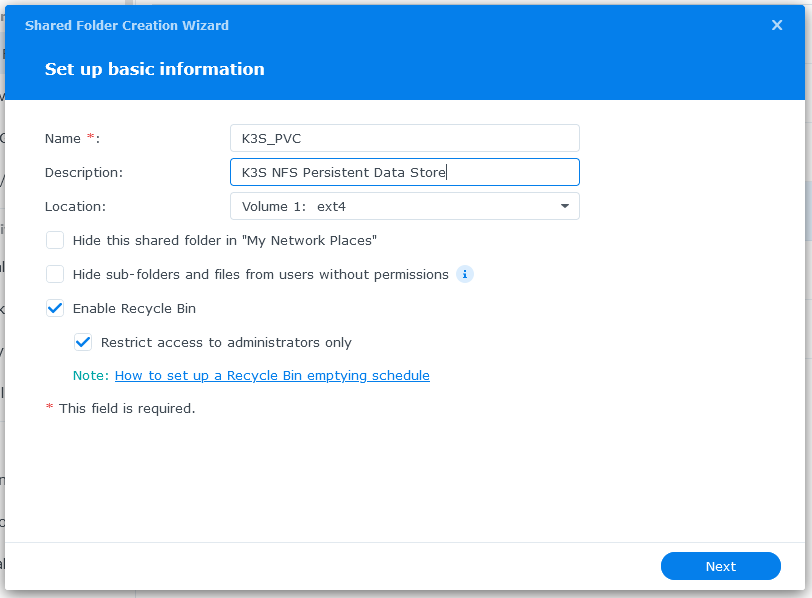
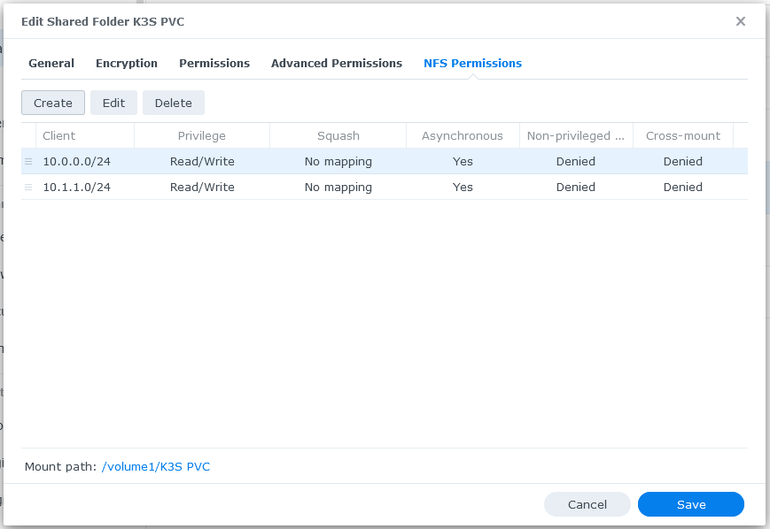

# Kubernetes Notes

## 1.) Install K3S

### 1.1.) Start by installing K3s & Kubectl

Installing k3s is relatively? simple.

```bash
sudo apt install linux-modules-extra-raspi nfs-common
# ...wait 30 minutes...
sudo reboot now
```

Now, if you're setting up a host, run:

```bash
# install k3s in host mode
curl -sfL https://get.k3s.io | sh -

# if you need to set up worker nodes, you'll need the node-token
sudo cat /var/lib/rancher/k3s/server/node-token

# in case you ever need to uninstall
/usr/local/bin/k3s-uninstall.sh
```

If setting up a worker node, modify the installation command and run to join:

```bash
# install k3s in agent (worker) mode. please replace `host_ip` and `token`.
curl -sfL https://get.k3s.io | K3S_URL=https://host_ip:6443 K3S_TOKEN=token sh -

# in case you ever need to uninstall
/usr/local/bin/k3s-agent-uninstall.sh
```

If you plan on managing from a separate machine, install kubectl. [Here's some instructions](https://kubernetes.io/docs/tasks/tools/install-kubectl-linux/#install-using-native-package-management).

### 1.2.) Copy config to proper locations

The default location of the config file is `/etc/rancher/k3s/k3s.yaml`, and it's
owned by root by default. Copy it to `~/.kube/config` on any of the machines you wish to connect to the cluster from and make sure it has good perms.

Your config should have the server address updated to point to the cluster. If attempting to connect on the machine hosting the cluster, make it `127.0.0.1`. Otherwise, make it the most machine's IP. DNS resolves here, btw.

```yaml
apiVersion: v1
clusters:
- cluster:
    certificate-authority-data: # ...snip...
    server: https://YOUR-HOST-IP-GOES-HERE:6443
# ...snip...
```

Check to see if kubectl works now:

```bash
$ kubectl get nodes
NAME       STATUS   ROLES                  AGE   VERSION
hostname   Ready    control-plane,master   59m   v1.22.7+k3s1
```

### 3.) Install Admin Dashboard

The Admin Dashboard is a pretty handy utility that allows you to visualize a lot of what's going on in your cluster. Here's how to install it.

On your master node, run the following commands:

```bash
GITHUB_URL=https://github.com/kubernetes/dashboard/releases
VERSION_KUBE_DASHBOARD=$(curl -w '%{url_effective}' -I -L -s -S ${GITHUB_URL}/latest -o /dev/null | sed -e 's|.*/||')
sudo k3s kubectl create -f https://raw.githubusercontent.com/kubernetes/dashboard/${VERSION_KUBE_DASHBOARD}/aio/deploy/recommended.yaml
```

This should install the dashboard for you. Now we just need to make a service account within the dashboard's namespace, in order to get an access token.

Make a file, `dashboard-make-user.yaml`, and put the following contents into it:

```yaml
apiVersion: v1
kind: ServiceAccount
metadata:
  name: username
  namespace: kubernetes-dashboard
---
apiVersion: rbac.authorization.k8s.io/v1
kind: ClusterRoleBinding
metadata:
  name: username
roleRef:
  apiGroup: rbac.authorization.k8s.io
  kind: ClusterRole
  name: cluster-admin
subjects:
- kind: ServiceAccount
  name: username
  namespace: kubernetes-dashboard
---
```

Now, apply it using kubectl, then get the token:

```bash
kubectl create -f dashboard-make-user.yaml
kubectl -n kubernetes-dashboard describe secret username-token | grep '^token'
```

Cache this token somewhere secure, you'll need it pretty frequently when the dashboard logs you out occasionally.

You can now access the dashboard by opening a terminal on your local machine, using your local copy of kubectl to start a proxy on your machine, then navigating to a special link:

```bash
kubectl proxy
```

Your dashboard can now be found at: http://localhost:8001/api/v1/namespaces/kubernetes-dashboard/services/https:kubernetes-dashboard:/proxy/

## 2.) Configure NFS

For many applications, it may be worthwhile to set up a persistent datastore somewhere, like on an NFS server. This section describes how to set up your cluster to use your NFS server as your default data store using Synology DSM as an example!

### 2.1) Set Up NFS Using Synology

Start by navigating to DSM in your browser and logging in. Then, go to Control Panel, and then enter the File Services menu. Go to the NFS tab, and enable the service, making sure the maximum protocol is set to `NFSv4`.



Now, ne need to make a new shared folder for the PVC to use. Go to the Shared Folder settings, and create a new folder, like `K3S_PVC` or whatever. Just no spaces.



Click through the rest of the settings. User permissions don't really matter here, as NFS bypasses them, but they can be configured if you wish to connect to the PVC server via SMB/FTP/AFS/etc. for management later.

Once the folder is made, right click on it and select "Edit". Then, navigate to the "NFS Permissions" tab. Here's the interesting bit: NFS authenticates by checking client IPs against a whitelist, rather than traditional RBAC. We'll need to whitelist the CIDR corresponding to our cluster.



Click Create, type in the CIDR into the first box, then leave everything else as-is and Save it. Copy the "Mount Path" value that shows up at the bottom, that'll be pretty important later! :)

### 2.2) Install nfs-subdir-external-provisioner Via Helm

Now we need to install our NFS provisioner!

If you don't have helm installed already, on your client that has access to the cluster, run the following:

```bash
curl -fsSL -o get_helm.sh https://raw.githubusercontent.com/helm/helm/main/scripts/get-helm-3
chmod 700 get_helm.sh
./get_helm.sh
```

Now, add the repo for our provisioner into Helm's databases:

```bash
helm repo add nfs-subdir-external-provisioner https://kubernetes-sigs.github.io/nfs-subdir-external-provisioner/
helm repo update
```

Finally, install the provisioner package, replaving variables where applicable:

```bash
helm install nfs-subdir-external-provisioner nfs-subdir-external-provisioner/nfs-subdir-external-provisioner \ 
    --set nfs.server=ip_to_your_synology \ 
    --set nfs.path=/mount/path/from/step/2.1 
```

Once it's applied, you can check the storageclasses available to your cluster:

```bash
$ kubectl get storageclass
NAME                   PROVISIONER
local-path (default)   rancher.io/local-path
nfs-client             cluster.local/nfs-subdir-external-provisioner
```

Now, lets swap `nfs-client` in to be our default datastore:

```bash
kubectl patch storageclass local-path -p '{"metadata": {"annotations":{"storageclass.kubernetes.io/is-default-class":"false"}}}'
kubectl patch storageclass nfs-client -p '{"metadata": {"annotations":{"storageclass.kubernetes.io/is-default-class":"true"}}}'
```

We're now good to go!

### 2.3) Test making a PVC

Now, lets make a test PVC, that would be used with one of our services.

Make a file, `pvc-example.yaml`, and pyt the following into it:

```yaml
apiVersion: v1
kind: PersistentVolumeClaim
metadata:
  name: pvc-example
spec:
  storageClassName: nfs-client
  accessModes:
    - ReadWriteMany
  resources:
    requests:
      storage: 100Mi
```

This yaml file creates a single PVC, `pvc-example`, which uses our nfs-client storage class, allows reading and writing, and requests at least 100 Mibibytes of storage.

Apply it, and you should see a new folder be made on the NFS server, that starts with `pvc-example`. Congrats! You've successfully configured NFS!

## 3.) Install Nginx to Host Static Content

### 3.1) Install NGINX

Installing Nginx is kind of complex, and involves several parts:

- We need a namespace to house everything
- We need a PVC to allow our cluster to serve our website on our NAS
- We need a service definition to allow our service to interface with Traefik later
- We need a deployment to actually spin up the server for us

Let's start with the namespace:

```yaml
apiVersion: v1
kind: Namespace
metadata:
  name: nginx
  labels:
    name: nginx
---
```

Apply this before anything else, and it should make a namespace for you.

Now, make the PVC:

```yaml
apiVersion: v1
kind: PersistentVolumeClaim
metadata:
  name: nginx-pvc
spec:
  storageClassName: nfs-client
  accessModes:
    - ReadWriteMany
  resources:
    requests:
      storage: 100Mi
---
```

Now, the service:

```yaml
apiVersion: v1
kind: Service
metadata:
  name: nginx-service
  labels:
    run: nginx
spec:
  ports:
    - port: 80
      protocol: TCP
  selector:
    app: nginx
---
```

And finally, the deployment:

```yaml
apiVersion: apps/v1
kind: Deployment
metadata:
  name: nginx-deployment
spec:
  selector:
    matchLabels:
      app: nginx
  replicas: 3
  template:
    metadata:
      labels:
        app: nginx
    spec:
      containers:
      - name: nginx
        image: nginx
        ports:
        - containerPort: 80
        volumeMounts:
        - name: html-volume
          mountPath: /usr/share/nginx/html
      volumes:
      - name: html-volume
        persistentVolumeClaim:
          claimName: nginx-pvc
---
```

Put all of those together in a single file and apply it! Your server should spin up and start serving your website, but we have no means of accessing it yet. Before we configure ingress, lets set up TLS.

### 3.2) HTTP Session Persistence

By default, K3S uses Traefik as its ingress controller, which we'll talk about in greater detail later. Essentially, this means that Traefik takes in all http(s) requests, checks them against Ingress rules you define, then routes that request to an internal service for further processing. For deployments with more than one replica, Traefik will perform some rudimentary "round-robin" load balancing on the requests. This can cause some issues with services that require authentication.

For example: Say Alice issues a request to authenticate with your service, which is handled by Pod A. After this request, Traefik advances its round-robin queue to prepare to send the next request to the next pod in sequence. Alice then requests to use her authentication to retrieve some data, and the request is forwarded to Pod B. Since Pod B did not authenticate Alice, her request is denied, and she may receive some undefined behavior instead.

This issue can be solved by issuing an affinity or "sticky session" cookie, a special cookie which lets Traefik know which pod originally handled the request and allows the client to maintain its session with that pod. This cookie lasts the duration of the session, after which the client's next request will go back through the load balancer.

Sticky session cookies are dead easy to implement. Go to the service definition and add the following, either through `kubectl` or the dashboard:

```yaml
metadata:
  annotations:
    traefik.ingress.kubernetes.io/service.sticky.cookie: 'true'
    traefik.ingress.kubernetes.io/service.sticky.cookie.name: cookie-name
```

That's all you need! Now web sessions should work properly.

### 3.3) Configure HTTPS

We'll dynamically configure our TLS certs using a useful tool, called cert-manager.

Apply cert-manager's boilerplate using the following command:

```bash
kubectl apply -f https://github.com/jetstack/cert-manager/releases/download/v1.8.0/cert-manager.yaml
```

Now, lets configure our providers that implement some of the classes from cert-manager. Make a file, `letsencrypt-cert-issuers.yaml`, and paste the following:

```yaml
apiVersion: cert-manager.io/v1
kind: ClusterIssuer
metadata:
  name: letsencrypt-staging
spec:
  acme:
    email: youremailhere@example.com
    server: https://acme-staging-v02.api.letsencrypt.org/directory
    privateKeySecretRef:
      name: letsencrypt-staging
    solvers:
    - http01:
        ingress:
          class: traefik
---
apiVersion: cert-manager.io/v1
kind: ClusterIssuer
metadata:
  name: letsencrypt-prod
spec:
  acme:
    email: youremailhere@example.com
    server: https://acme-v02.api.letsencrypt.org/directory
    privateKeySecretRef:
      name: letsencrypt-prod
    solvers:
    - http01:
        ingress:
          class: traefik
---
```

Apply the file, and you should now have two cert issuers that use certbot's prod and staging servers respectively!

While we're here, we should really configure a redirect to force our traffic to use HTTPS. Here's a hack:

```yaml
apiVersion: traefik.containo.us/v1alpha1
kind: Middleware
metadata:
  name: redirect-https
spec:
  redirectScheme:
    scheme: https
    permanent: true
---
```

Apply that! Now, we're about ready to get our Ingress configured!

### 3.4) Configure Ingress

Any data that comes through on 80 or 443 goes through our ingress controller, Traefik. Let's use an ingress definition to tell our router how to forward our data.

Make yet another yaml file and give it the following contents:

```yaml
---
apiVersion: networking.k8s.io/v1
kind: Ingress
metadata:
  name: nginx-ingress
  annotations:
    kubernetes.io/ingress.class: "traefik"
    cert-manager.io/cluster-issuer: "letsencrypt-prod"
    traefik.ingress.kubernetes.io/router.middlewares: default-redirect-https@kubernetescrd
spec:
  rules:
  - host: yourdomainhere.com
    http:
      paths:
      - path: /
        pathType: Prefix
        backend:
          service:
            name: nginx-service
            port:
              number: 80
  tls:
  - secretName: yourdomainhere-com-tls
    hosts:
    - yourdomainhere.com

```

Before we apply it, let's understand a few things:

- Every instance of `yourdomainhere.com` should be replaced with your actual domain
  - The TLS secret name should also match your domain name, but must only have dashes and letters. I usually replace periods with dashes, as shown in the example.
- The Path and PathType are **SUPER** sensitive to their configuration. Make sure this is configured as expected! [Reference Located Here](https://kubernetes.io/docs/concepts/services-networking/ingress/#path-types).
- You don't have to have a host definition, but its useful!
  - You can use a local DNS server to have different domain names all point to your cluster, and then the ingress controller can use the domain attached to each request to route you to your various web interfaces, despite all apps being on a single set of IPs!
- If this were a staging environment, we'd want to make sure that our cert-manager metadata was set to `"letsencrypt-staging"`, the name of the class we defined earlier.

Now apply it, and your site should be live!

## 4.) Installing PiHole

### 4.1) Setting up the Basics

Let's start by setting up the basics: a namespace and PVC!

```yaml
apiVersion: v1
kind: Namespace
metadata:
  name: pihole
  labels:
    name: pihole
---
apiVersion: v1
kind: PersistentVolumeClaim
metadata:
  name: pihole-config
  labels:
    app: pihole
spec:
  storageClassName: nfs-client
  accessModes:
    - ReadWriteMany
  resources:
    requests:
      storage: 500Mi
---
```

We'll also need a secret: the admin panel password!

```yaml
apiVersion: v1
kind: Secret
metadata:
  name: pihole-webpassword
  namespace: pihole
data:
  password: YOUR_BASE64_ENCODED_PASS_HERE
type: Opaque
```

### 4.2) Deploying

Deploying Pihole is pretty fun! Look at how long this one is!

```yaml
apiVersion: apps/v1
kind: Deployment
metadata:
  name: pihole-deployment
  namespace: pihole
  labels:
    app: pihole
spec:
  selector:
    matchLabels:
      app: pihole
  strategy:
    rollingUpdate:
      maxSurge: 1
      maxUnavailable: 1
    type: RollingUpdate
  template:
    metadata:
      creationTimestamp: null
      labels:
        app: pihole
    spec:
      containers:
      - image: pihole/pihole
        imagePullPolicy: IfNotPresent
        name: pihole
        env:
        - name: ADMIN_EMAIL
          value: your@email.com
        - name: WEBPASSWORD
          valueFrom:
            secretKeyRef:
              key: password
              name: pihole-webpassword
        ports:
        - containerPort: 80
          name: pihole-http
          protocol: TCP
        - containerPort: 53
          name: dns
          protocol: TCP
        - containerPort: 53
          name: dns-udp
          protocol: UDP
        - containerPort: 443
          name: pihole-ssl
          protocol: TCP
        - containerPort: 67
          name: client-udp
          protocol: UDP
        volumeMounts:
        - mountPath: /etc/pihole
          name: config
        resources: {}
        terminationMessagePath: /dev/termination-log
        terminationMessagePolicy: File
      volumes:
      - name: config
        persistentVolumeClaim:
          claimName: pihole-config
      dnsPolicy: ClusterFirst
      restartPolicy: Always
      schedulerName: default-scheduler
      securityContext: {}
      terminationGracePeriodSeconds: 30
  progressDeadlineSeconds: 600
  replicas: 1
  revisionHistoryLimit: 10
status: {}
```

### 4.3) Exposing The Services

Now, this case is interesting because we functionally have two services that we want to expose:

- The first is the HTTP Admin portal, which we probably want to go thru traefik
- The second is the actual DNS traffic on port 53, which we'd like to have each of our nodes serve

As we have two separate service formats, we need to define two services for the cluster to use. First, the web portal, and its ingress. Pretty easy!

```yaml
apiVersion: v1
kind: Service
metadata:
  name: pihole-web
  namespace: pihole
  labels:
    run: pihole
spec:
  ports:
  - name: pihole-http
    port: 80
    protocol: TCP
  selector:
    app: pihole
---
kind: Ingress
apiVersion: networking.k8s.io/v1
metadata:
  name: pihole-ingress
  namespace: pihole
  annotations:
    cert-manager.io/cluster-issuer: letsencrypt-prod
    kubernetes.io/ingress.class: traefik
    traefik.ingress.kubernetes.io/router.middlewares: default-redirect-https@kubernetescrd
spec:
  rules:
    - host: pihole.yourdomain.com
      http:
        paths:
          - path: /admin
            pathType: Prefix
            backend:
              service:
                name: pihole-web
                port:
                  number: 80
  tls:
    - hosts:
        - pihole.yourdomain.com
      secretName: pihole-yourdomain-com-tls
```

And the more complex service, which will actually expose our services on the cluster's actual IPs, is a LoadBalancer type:

```yaml
apiVersion: v1
kind: Service
metadata:
  name: pihole-dns
  namespace: pihole
  labels:
    run: pihole
spec:
  type: LoadBalancer
  ports:
  - name: pihole-dns-tcp
    port: 53
    targetPort: 53
    protocol: TCP
  - name: pihole-dns-udp
    port: 53
    targetPort: 53
    protocol: UDP
  externalTrafficPolicy: Local
  sessionAffinity: None
  selector:
    app: pihole
---
```

This makes a load balancer which disperses the load over the three pods we have running!

Note that NodePort didnt work for me, and `externalTrafficPolicy: Local` means the actual IPs are logged in pihole. :)

## A.) Appendix: References

- K3S.Rocks: https://k3s.rocks/
- K3S Dashboard: https://rancher.com/docs/k3s/latest/en/installation/kube-dashboard/
- NFS Provisioner Srtup: https://kamrul.dev/setup-dynamic-nfs-provisioning-in-kubernetes-with-helm-3/
- Kubernetes Ingress: https://kubernetes.io/docs/concepts/services-networking/ingress/#path-types
- Official Kubernetes API Ref: https://kubernetes.io/docs/reference/generated/kubernetes-api/v1.19/
- Short Ingress Ref: https://itnext.io/ingress-with-treafik-on-k3s-53db6e751ed3
- Official NFS YAML ref: https://github.com/kubernetes/examples/tree/master/staging/volumes/nfs
- TLS Provisioner Setup: https://opensource.com/article/20/3/ssl-letsencrypt-k3s
- Hacky K3S Pihole Ref: https://github.com/colin-mccarthy/k3s-pi-hole